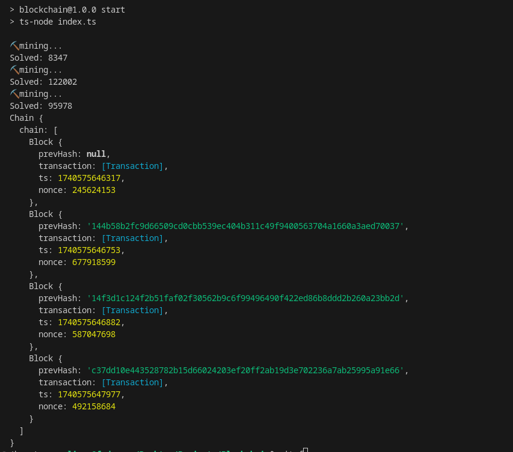

# blockchain-simulator
A simple blockchain implemented through TypeScript, Using Proof of State model,  Showcase transaction.  Based on [Fireship](https://www.youtube.com/watch?v=qF7dkrce-mQ)

## Results

